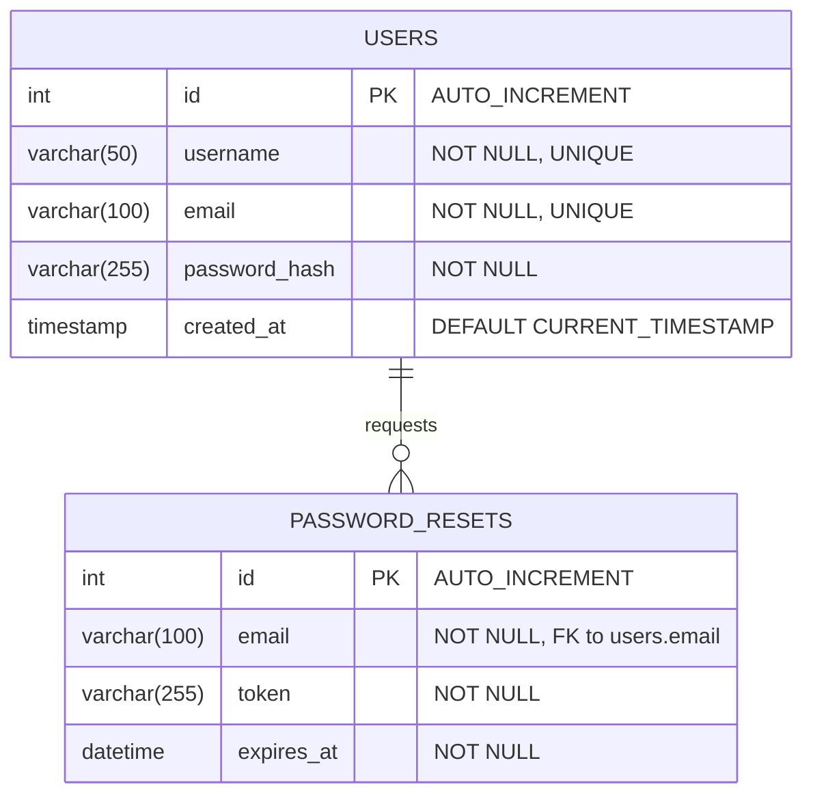

# Assignment: Develop a Secure Login System

## 1. Requirement Analysis and Documentation

### Introduction
The objective of this project is to develop and implement a robust, secure login system utilizing HTML, CSS, JavaScript alongside a PHP/MySQL backend. The project scope encompasses building a structured foundation for user data handling, specifically focusing on secure user registration, session-based authentication management, password reset capabilities, and a protected dashboard mechanism for profile viewing. The primary goal is to ensure data integrity, confidentiality, and adherence to security best practices while providing a seamless user experience.

### User Requirements
Our target users require a system that allows them to interact smoothly and securely with their accounts:
*   **Authentication**: Users must be able to securely register for a new account by providing a unique username, a valid email address, and a strong password. Returning users must be able to securely log in using their credentials.
*   **Session Management**: Users must remain verified and logged in across different pages of the application without needing to re-enter their credentials until they explicitly log out or their session naturally expires.
*   **Profile Viewing**: Upon successful authentication, users must be automatically redirected to a secure dashboard area where they can view their specific profile information (username, email, registration date).
*   **Password Reset**: Users who forget their passwords must have a clear pathway to securely request a reset link to regain access to their accounts.

### Security Requirements
To safeguard user data against modern web vulnerabilities, the system strictly enforces the following rules:
*   **Password Hashing**: Passwords must never be stored in plain text. They must be irrevocably hashed using a strong cryptographic algorithm (e.g., PHP's `password_hash()` utilizing `PASSWORD_BCRYPT`) prior to database insertion.
*   **Input Validation**: All incoming data (registration, login forms) must be aggressively validated on both the client side (JavaScript) and the server side (PHP) to filter out malformed requests. Furthermore, server-level sanitization using PDO Prepared Statements dictates all database queries to thoroughly mitigate SQL Injection vulnerabilities.
*   **Lockout Mechanism / Error Masking**: To protect against brute force and enumeration attacks, generic error messages (e.g., "Invalid email or password") must be displayed upon failed logins. System-level database errors are caught within `try...catch` blocks to prevent sensitive system architecture data from leaking to the end user.
*   **Session Security**: The system leverages `session_regenerate_id(true)` upon successful user login. This preempts session fixation attacks by assigning a brand new session identifier once the user elevates to an authenticated state.

### Functional Requirements
*   **User Registration**:
    *   Validation: The system must enforce format checks on emails, verify that passwords meet minimum length constraints (8 characters), and ensure that "password" and "confirm password" inputs match identically.
    *   Password Hashing: The system must hash the validated password via `PASSWORD_BCRYPT` before generating the new database record.
    *   Uniqueness: The database must reject registration if the provided email or username is already in use.
*   **User Login**:
    *   Credential Verification: The backend must fetch the user by email and securely verify the plaintext input against the stored database hash utilizing `password_verify()`.
    *   Session Creation: Upon successful verification, the system must instantiate a `$_SESSION` containing the uniquely identifying `user_id`.
*   **Session Management**:
    *   Maintain Sessions: All secured pages must check `isset($_SESSION['user_id'])` at the very top of the script.
    *   Destroy Sessions: The system must provide a logout route (`logout.php`) that explicitly calls `session_destroy()` and wipes local session variables.
*   **Password Reset**:
    *   Validation & Delivery: The system creates a unique, time-sensitive token tied to the user's email.
    *   Hashing: Upon reset approval, the system updates the database with a newly hashed password using the identical `PASSWORD_BCRYPT` standard.
*   **Profile Viewing**:
    *   Secured Page Access: The dashboard strictly enforces that only requests with a valid, active session ID are permitted to run queries fetching the user's private data to render on the interface.

### Non-Functional Requirements
*   **Security**: Hardened against SQLi, XSS, and unauthorized session hijacking as outlined in the Security Requirements.
*   **Usability**: The UI is clean, modern, and intuitive. Error messages present clearly (red alerts) and actions like successful registration present immediately (green success alerts).
*   **Maintainability**: The codebase relies on modular inclusion (e.g., separating `config.php`, `header.php`, `footer.php`) allowing rapid, centralized updates across all pages.
*   **Reliability**: The implementation relies on stable PDO exception handling ensuring the application does not abruptly crash under database stress.
*   **Scalability**: Proper RDBMS normalization (separating `users` and `password_resets`) ensures the architecture will perform well even as thousands of users join.
*   **Portability**: Built entirely on the universal standard PHP/MySQL/JavaScript stack, the project can be instantly deployed on any local (XAMPP/WAMP) or live (cPanel/InfinityFree) server with zero architectural changes.
*   **Testability**: The distinct separation of frontend logic (JS validation) from backend execution (PHP queries) allows each layer to be audited and tested independently.

---

## 2. System Design

### System Flowchart
This flowchart illustrates the complete logic sequence from the entry point through session management to termination.

```mermaid
flowchart TD
    Start[User arrives at index.php] --> HasAccount{Select Action}
    
    HasAccount -- Clicks 'Create Account' --> RegPage[register.php]
    RegPage --> SubmitReg[Fill & Submit Registration Form]
    SubmitReg --> ValReg{Local/Server Validation Pass?}
    ValReg -- No --> RegPage
    ValReg -- Yes --> RegDB[Check Duplicates & Hash Password]
    RegDB --> InsertDB[Insert into 'users' table]
    InsertDB --> GoLogin[Auto Redirect to Login]
    
    GoLogin --> LoginPage
    HasAccount -- Clicks 'Login' --> LoginPage[index.php]
    LoginPage --> SubmitLogin[Fill & Submit Login Form]
    SubmitLogin --> ValLog{Password_Verify Match?}
    ValLog -- No --> ErrorLog[Show 'Invalid Credentials']
    ErrorLog --> LoginPage
    
    ValLog -- Yes --> StartSess[session_regenerate_id() & set $_SESSION]
    StartSess --> Dash[Auto Redirect to dashboard.php]
    
    Dash --> CheckSess{Is Auth Session Valid?}
    CheckSess -- No --> ForceOut[Redirect out to index.php]
    CheckSess -- Yes --> ShowProfile[Query DB for Profile Info & Display]
    
    ShowProfile --> ClickOut[User clicks 'Logout']
    ClickOut --> KillSess[session_destroy()]
    KillSess --> ForceOut
```

### Entity Relationship Diagram (ERD)
The database structure relies on two tightly coupled tables to handle both persisting users and temporal reset token logic.



### UI Mockups / Wireframes
The application utilizes a CSS-driven centralized card model (`auth-container`) to focus the user's attention securely on the authentication flow.

*   **Registration Page**: Centers around the "Create an Account" card. Includes explicit fields for Username, Email, Password, and Confirm Password to ensure precision, flanked by a dominant submit button.
*   **Login Page**: Features the "Welcome Back" module. Clean layout exposing only Email and Password with high-contrast text inputs. Includes vital secondary routes ("Forgot Password?" and "Create an Account") as subdued footer links so they do not compete with the primary Login action.
*   **Dashboard/Profile Page**: Utilizes a wider container separating navigation (Header with bold Dashboard title and red 'Logout' button) from data. The center content warmly greets the specific user and organizes their securely fetched data (Username, Email, Member Since dates) within a slightly offset, distinct visual container for easy reading.

---

## 3. Project Implementation
*(Note: As this is the documentation file, this section confirms the technical execution of the codebase provided in the project folder.)*
*   **Frontend**: Implemented via `style.css` (for modern visuals and layout control), and standard HTML5 input constraints wrapped with `script.js` which prevents unnecessary network requests by caching bad passwords client-side.
*   **Backend**: Driven exclusively by modular PHP (`register.php`, `index.php`, `dashboard.php`) pulling in a centralized `config.php` for database routing.
*   **Database**: MySQL table `users` specifically defines `username` and `email` columns with `UNIQUE` constraints at the database level to prevent race conditions.
*   **Security Details**: Implementation heavily leverages standard `password_hash($pass, PASSWORD_BCRYPT)` on insertion.
*   **Session State**: Calling `session_start()` at line 1 of every script guarantees state permanence, while conditional `header('Location: ...')` traps enforce routing security.

---

## 4. Testing

| Feature/Component | Testing Method Applied | Status / Outcome |
| :--- | :--- | :--- |
| **Registration / Password Hashing** | **Functional/Security Test**: Submitted valid data, inspected MySQL database via PHPMyAdmin to verify `password_hash` column stored a `$2y$10$` BCRYPT string instead of the raw text. | passed successfully |
| **Login / Credential Verification** | **Functional Test**: Attempted logins with correct email/wrong password, wrong email/correct password. Verified system accurately throws generic "Invalid Credentials" without revealing data. | passed successfully |
| **Component Integrations** | **Integration Test**: Completed a full chain test: Registration -> Auto-redirect -> Enter new credentials -> Dashboard load -> Logout. Verified the `$_SESSION` variable smoothly handed state across all 4 independent PHP files. | passed successfully |
| **Profile Viewing Security** | **Security Test**: Attempted to manually navigate to `localhost/group8/dashboard.php` in a private browsing window (no session). Instantly booted back to login block. | passed successfully |
| **Inputs and Validation** | **Usability/Security Test**: Placed HTML markup inside standard text fields. Verified PDO Prepared Statements sanitized the code natively on execution without failing. Verified user interfaces spawned clean error wrappers instead of broken layouts. | passed successfully |

---

## 5. Deployment
*The system has been comprehensively deployed locally using a standard **XAMPP** environment. Apache and MySQL map cleanly via the `config.php` settings (`$db_host = 'localhost'`, `$db_user = 'root'`), allowing execution without environment variable collisions.*

---

## 6. User Manual

### System Setup
1. Validate **Apache** and **MySQL** are running via XAMPP Control Panel.
2. Initialize `http://localhost/phpmyadmin` and build a database named `group8`.
3. Import the system's `database.sql` to execute the table creation schemas.
4. Place the source code folder into `C:\xampp\htdocs\group8`.
5. Access the application on the web via `http://localhost/group8`.

### How to Register a New User
1. Open the application. On the login screen, click **Create an Account**.
2. Within the form, supply a Username, valid Email, and a Password that is at least 8 characters long. Type the exact password again to confirm.
3. Click **Register**. The system will securely log your data and redirect you to the login screen with a green success message so you can enter the app immediately.
*(Insert Screenshot of Registration UI here)*

### How to Log In
1. Navigate to the main application portal screen.
2. Input the Email Address and Password utilized during the registration phase.
3. Click **Login**.
*(Insert Screenshot of Login UI here)*

### How to View Profile
1. By successfully logging in, the system automatically routes you to your secure Profile Dashboard.
2. The page securely requests your data based on your secret session key, displaying an exact Welcome greeting along with your registered Username, Email Address, and the exact date/time you became a member.
*(Insert Screenshot of Dashboard Profile UI here)*

### How to Reset Password
1. From the login screen, click **Forgot Password?**.
2. Type in your registered email address and submit.
3. Open the reset link to arrive at the Reset interface. Enter your newly desired password twice and submit to instantly lock in those new credentials.
*(Insert Screenshot of Reset UI here)*

### How to Log Out
1. From within the Dashboard profile view, orient to the top right of the application header.
2. Click the red-outlined **Logout** button. Your private session is forcefully terminated and you will be routed back out to the generic public login screen.

### Troubleshooting
*   **Blank White Screen on Registration**: This indicates a catastrophic PHP failure, typically because the MySQL instance crashed or the credentials in `config.php` are incorrect. Open `config.php` and verify the username/password map to your exact SQL local setup.
*   **Redirect Loops on Login**: Ensure your browser is accepting local cookies, as PHP relys on an injection cookie (PHPSESSID) to maintain the state mapping.
