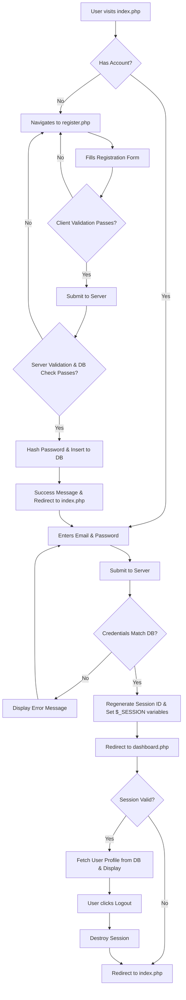
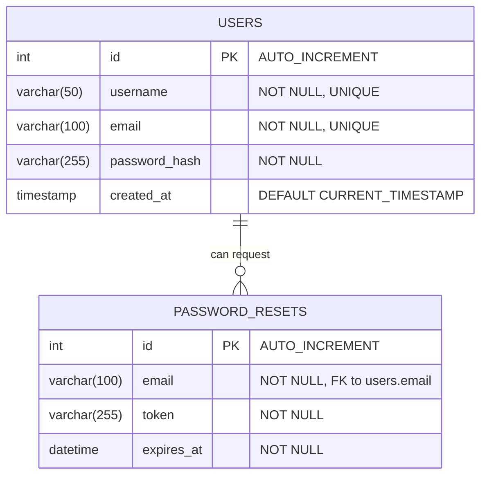

# System Design: Secure Login System

## 1. System Flowchart
This flowchart illustrates the complete user journey and logic flow throughout the authentication lifecycle.

## 2. Entity Relationship Diagram (ERD)
The database for the secure login system requires robust and normalized data structures for users and password reset logic.

## 3. UI Mockups / Wireframes

While actual high-fidelity designs are implemented in `style.css`, the fundamental wireframes of the application focus on centering the authentication block (`auth-container`) on the screen with a clean, modern aesthetic.

### Registration Page Wireframe
- Main Centered Card Container
- Title: "Create an Account"
- Text Input: Username
- Email Input: Email Address
- Password Input: Password
- Password Input: Confirm Password
- Primary Button: "Register" (Solid color)
- Footer Link: "Already have an account? Login here"

### Login Page Wireframe
- Main Centered Card Container
- Title: "Welcome Back"
- Space reserved for Success/Error Alert messages (e.g., "Registration successful!")
- Email Input: Email Address
- Password Input: Password
- Primary Button: "Login" (Solid color)
- Footer Links: "Forgot Password?" | "Create an Account"

### Dashboard (Profile) Wireframe
- Main Container with Top Header
- Header Left: "Dashboard"
- Header Right: "Logout" (Secondary Button, outline styling)
- Welcome Message: "Welcome, [Username]!" (Followed by dynamic success alerts if logging in)
- Profile Information Card (Slightly darker background):
  - Username: [Value]
  - Email Address: [Value]
  - Member Since: [Date]
